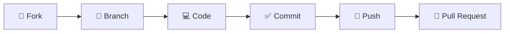

<div align="center">

# 🦜 Vogelkop Data Center

**A centralized data management system for the Bird's Head Peninsula, West Papua**

[](https://golang.org/)
[](https://www.postgresql.org/)
[](https://www.docker.com/)
[](LICENSE)

---

_Facilitating biodiversity research and conservation efforts through robust data infrastructure_

</div>

## 📖 Overview

**Vogelkop Data Center** is a centralized repository and management system designed to aggregate, process, and serve data related to the Vogelkop region (Bird's Head Peninsula), West Papua.

This project aims to provide a robust infrastructure for handling diverse datasets—ranging from **geospatial mappings** and **biodiversity surveys** to **climatological records**—facilitating analysis and decision-making for researchers and stakeholders operating in the region.

## ✨ Key Features

| Feature                        | Description                                                                  |
| ------------------------------ | ---------------------------------------------------------------------------- |
| 🔄 **Data Ingestion Pipeline** | Automated ETL workflows for varied data formats (CSV, GeoJSON, NetCDF)       |
| 🗺️ **Geospatial Integration**  | Native support for GIS data visualization and queries specific to West Papua |
| 🔌 **API Access**              | RESTful API endpoints for external applications to retrieve processed data   |
| 🔐 **Secure Storage**          | Role-based access control (RBAC) to protect sensitive conservation data      |

## 🛠️ Tech Stack

<div align="center">

|     Layer     | Technology                                                                                                                                                                                                             |
| :-----------: | :--------------------------------------------------------------------------------------------------------------------------------------------------------------------------------------------------------------------- |
| **Language**  |                                                                                                                                 |
| **Database**  |   |
|  **Backend**  |                                                                                                                           |
| **Frontend**  |                                                                                                                        |
| **Container** |                                                                                                                     |
|   **CI/CD**   |                                                                                             |

</div>

## 📂 Project Structure

```
vogelkop-data-center/
├── 📁 api/                    # Backend API source code
├── 📁 data/                   # Sample datasets and schemas
├── 📁 docs/                   # Documentation and architectural diagrams
├── 📁 scripts/                # ETL and maintenance scripts
├── 📁 tests/                  # Unit and integration tests
├── 🐳 docker-compose.yml      # Container orchestration
└── 📄 README.md               # Project documentation
```

## ⚡ Getting Started

### Prerequisites

Before you begin, ensure you have the following installed:

- 🐳 **Docker & Docker Compose** — Container runtime
- 🔷 **Go 1.21+** — Programming language
- 📦 **Git** — Version control

### Installation

**1. Clone the repository**

```bash
git clone https://github.com/BBKSDAPBD/vogelkop-data-center.git
cd vogelkop-data-center
```

**2. Environment Setup**

Copy the example environment file and configure your database credentials:

```bash
cp .env.example .env
```

**3. Build and Run**

Start the services using Docker Compose:

```bash
docker-compose up --build
```

**4. Access the Application**

| Service      | URL                                                      |
| ------------ | -------------------------------------------------------- |
| 🖥️ Dashboard | [http://localhost:3000](http://localhost:3000)           |
| 📚 API Docs  | [http://localhost:8000/docs](http://localhost:8000/docs) |

## 🤝 Contributing

We welcome contributions from the community, especially those with expertise in **regional biodiversity data** or **geospatial engineering**.



1. **Fork** the Project
2. **Create** your Feature Branch
   ```bash
   git checkout -b feature/AmazingFeature
   ```
3. **Commit** your Changes
   ```bash
   git commit -m 'Add some AmazingFeature'
   ```
4. **Push** to the Branch
   ```bash
   git push origin feature/AmazingFeature
   ```
5. **Open** a Pull Request

## 📄 License

Distributed under the **MIT License**. See [`LICENSE`](LICENSE) for more information.

---

<div align="center">

## 📞 Contact

For inquiries regarding data access or partnerships, please contact the project maintainers.

**Maintainer:** [Balai Besar KSDA Papua Barat Daya](https://github.com/BBKSDAPBD)

[](https://github.com/BBKSDAPBD/vogelkop-data-center)

---

<sub>Made with ❤️ for conservation in West Papua</sub>

</div>
